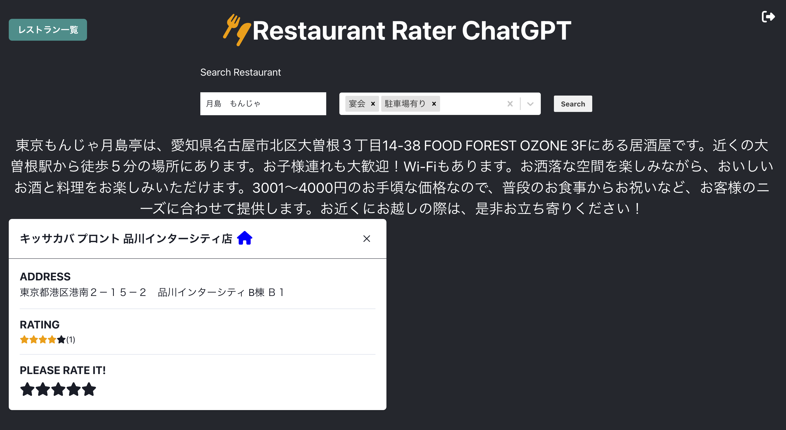

# Chat-GPT_Hotpepper_App



とりあえずReact + Django版のChat-GPT_Hotpepper_Appを作成しました

無限ロードに陥ったりと、まだまだ問題がたくさんあるので、これを叩き台に改善するのはいかがでしょう?

## 初期設定
```
cd backend_project
docker-compose build --no-cache
docker-compose up -d
docker-compose run backend django-admin startproject [プロジェクト名(私の場合restaurant_chatgpt)] .
docker-compose exec backend bash
#ここからDockerコンテナ内
$django-admin startapp [アプリ名(私の場合recommend_restaurant)]
$python manage.py createsuperuser
```

## 各分担の流れ

1. フロントエンド、React(Yugen君担当)
下のコマンドを実行して! (めんどいからDockerfileに書き込んじゃっても良いかも)
```
cd frontend_project
docker-compose build --no-cache
docker-compose run --rm node sh -c "npm install -g create-react-app && create-react-app [アプリ名]"
docker-compose up -d
docker-compose exec node sh
#ここからDockerコンテナ内
$cd [アプリ名]
$npm i --save @fortawesome/fontawesome-svg-core
$npm install --save @fortawesome/free-solid-svg-icons
$npm install --save @fortawesome/react-fontawesome
$npm install react-cookie
$npm install react-router-dom
```

2. Aobaさん: ホットペッパーAPI周り，取得した情報をフィルタリング，Djangoを使ってバックエンド実装 [ここらへん](./backend_project/backend/recommend_restaurant)いじる感じだと思う

3. Yamaji君 : お店の名前等でスクレイピングでレビュー取得: 割と手付かずなのでバックエンドで新しくスクレイピング関連のAPI作る必要ありそう

4. Fuchi君 [ここらへん](./backend_project/backend/recommend_restaurant/chatGPT.py)あたり

5. 私、ゆっくり.状況に応じてデータベースの更新
